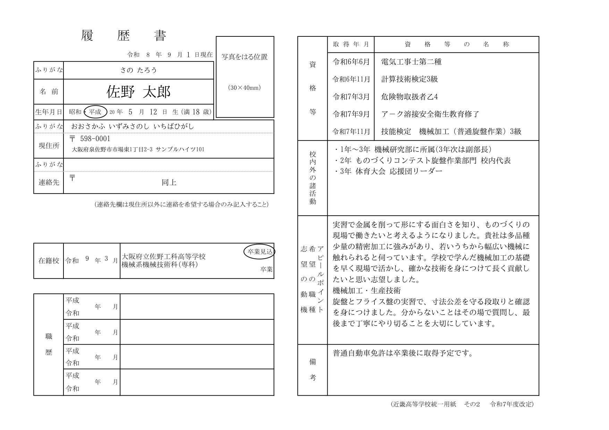
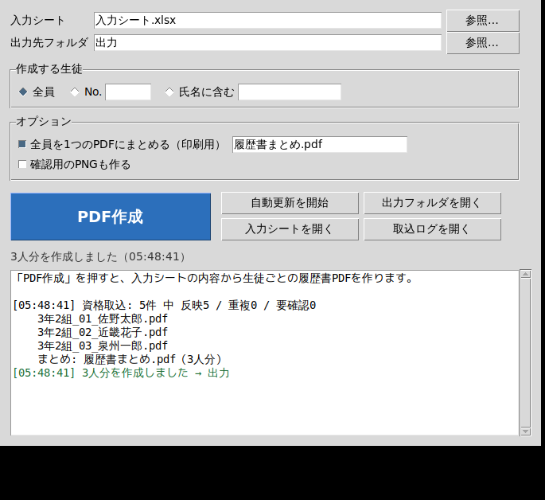

# 履歴書 自動作成システム（近畿高等学校統一用紙 その2）

**Excelだけで完結します。** `履歴書作成.xlsm` を開いて「入力」シートに名列順で打ち込むと、
生徒ごとの履歴書シート（01〜40）に自動で反映され、そのままPDFにできます。
Pythonのインストールは要りません。

| ファイル | 中身 |
| --- | --- |
| `履歴書作成.xlsm` | **本体**（これを使ってください） |
| `履歴書マクロ.bas` | 文字の大きさを自動でそろえる仕組み（同じフォルダーに置く・入れなくても動きます） |
| `履歴書作成.xlsx` | 中身は同じ。マクロを一切使わない場合はこちら |



## 使い方（Excelだけ）

1. **`履歴書作成.xlsm` を開く**（Excel 2016以降）
2. **「入力」シートに名列順で入力する**（1行＝1生徒）
   - **黄色 ＝ 打ち込むところ／水色 ＝ 自動で入るところ**（上から書けば手入力が優先）
   - 名前が空の行は**グレー**になるので、使っている行がひと目で分かります
   - 資格・職歴の列は **＋/− ボタンでたたむ**ことができます（職歴は最初から閉じています）
   - 生年月日・郵便番号などのセルを選ぶと、**入力のヒント**が出ます
   - 学科は**6種類からドロップダウンで選択**（空欄なら「設定」の既定の学科）
   - 生年月日は `2008/5/12`・`2008年5月12日`・`平成10年12月20日` のどれでもOK → **元号・満○歳は自動**
   - 連絡先は、現住所と違うときだけ入力（無記入なら空欄で印刷されます）
3. **「履歴書」シートがそのまま用紙**（1人＝1ページ・上から入力シートのNo順）
4. **印刷・PDFにする（No.○ から No.○ まで）**
   1. 「設定」シートの **【開始No】【終了No】** に番号を入れる（1人だけなら同じ番号）
   2. **【▶ 印刷する】ボタン**を押す → 「履歴書」シートに移動します
   3. そのまま **Ctrl+P**（ファイル → 印刷）→ **指定した範囲だけ**が出ます
      PDFにするなら、プリンターで「Microsoft Print to PDF」を選ぶか、
      「ファイル → 名前を付けて保存 → PDF」

   > **1人＝ちょうど1ページ**です（A4横）。**枠の大きさは公式様式と同じ原寸（拡大縮小97%）**で、
> **用紙の中央**に印刷されます（左右24.9mm・上下5.4mmの余白）。
> ページ数が人数と一致しないときは、印刷設定の「拡大縮小」が **97%**、
> 余白が **0.1** インチ、「ページ中央」の**水平・垂直の両方**にチェックが入っているか
> 確認してください（余白と中央そろえは枠の大きさを変えません）。
>
> 範囲がうまく効かないときは、印刷画面の「ページ指定」に同じ番号を入れてください。
   > **1ページ＝生徒1人**なので、**ページ番号＝入力シートのNo** です。

### シートの役割

タブに色が付いています（青＝案内、黄＝打ち込む、緑＝用紙、橙＝設定・取込、灰＝マスタ）。
各シートの左上の【◀ 使い方】から、いつでも案内シートに戻れます。

| シート | 役割 |
| --- | --- |
| 使い方 | 3ステップの手順（ブックを開くと最初に出ます・各シートへのボタン付き） |
| 入力 | 生徒の情報（1行＝1生徒・名列順・40人分） |
| 履歴書 | 印刷する用紙（公式様式そのまま・1人＝1ページ・40ページ） |
| 資格取込 | 資格一覧を貼り付けると、名簿と照合して自動で振り分け（400行まで） |
| マクロ | 文字の大きさを自動でそろえるVBAと、その入れ方（任意） |
| 設定 | **印刷する範囲（開始No〜終了No）**、基準日、学校名、既定の学科、卒業（見込）年月 |
| 反映項目 | 履歴書に出す項目を○×で選ぶ（12項目） |
| 学科マスタ | 在籍校欄に出す学科（6種類・書き換え可） |
| 資格マスタ | 入力した資格名を正式名称に直す変換表（70件） |
| 計算・資格集約・郵便番号 | 自動計算用（非表示） |

### 自動で入るもの

| 入力する項目 | 自動で入るもの |
| --- | --- |
| 氏名・ふりがな | 枠の中央に配置 |
| 生年月日 | **元号の年**、**満○歳**（設定の基準日で計算） |
| 郵便番号 | `5980001` → `598-0001` |
| ふりがな（住所）・連絡先ふりがな | **郵便番号を入れた時点で「入力」シートに自動で入ります**（大阪府・和歌山県・奈良県） |
| 連絡先 | 無記入なら **空欄のまま**（現住所と違うときだけ入力） |
| 資格（手入力6枠＋取込20件） | **取得年月順に並べ替え**、**資格マスタで正式名称に変換**、和暦で表示（**1人あたり最大26件**）<br>取得年月は `令和6年6月`・`2024/6`・`2024/6/10` のどれでもOK |
| 学科 | 6種類から選択 → 在籍校欄に学校名と一緒に印字 |
| 志望の動機・希望の職種・アピールポイント | **「入力」シートでは1つの欄**。改行して続けて書けます |

> 用紙は学校の公式様式（近畿高等学校統一用紙 その2・令和7年度改定のExcel版）を
> そのまま使っています。罫線や文言は一切変えていません。

### 資格をまとめて取り込む（貼り付けるだけ）

「資格取込」シートの **A6以降** に、資格取得の一覧を **1行＝1件** で貼り付けてください。

```
3-2-15	山田 太郎	基礎製図検定	令和6年7月10日
3-2-2 近畿 花子 実用英語検定2級 2025/6/8
近畿花子 色彩検定３級 令和7年7月13日
```

- 並び順は **学年-組-出席番号 → 氏名 → 資格名 → 取得日**（区切りは空白でもタブでも全角空白でも可）
- **氏名は「山田 太郎」のように姓と名が離れていても大丈夫**です。名簿と突き合わせて、
  どこまでが氏名でどこからが資格名かを自動で判断します（姓名がくっついていても可）
- **先頭の番号がない行は氏名で照合**します（氏名の空白は無視）
- 資格名の**空白（半角・全角）の違いは無視**して資格マスタと照合し、正式名称で印字します
- 取得日は `令和6年7月10日` `2025/6/8` `2026-2-5` `令和6年7月`（日なし）のどれでも読めます
- **「状態」列**に 反映／重複／要確認 が **緑・灰・赤** で色分けして出ます（赤い行だけ直せばOK）
- 途中の計算列は隠してあり、見るのは **貼付原文・氏名・資格名・取得日・状態** の5つだけです
- 手入力した資格と合わせて **取得年月の古い順** に並べ、資格マスタの正式名称で印字します
  （1人あたり **手入力6件＋取込20件＝最大26件**。取込が20件を超えた行は「状態」列で知らせます）
- すでに「入力」シートに手入力してある資格と同じものは **重複として飛ばします**

すべてExcelの数式でできているので、ここまでにマクロは要りません。

### 文字の大きさと、欄に入りきらないとき

用紙の文字は **11pt**（基本＝最大）です。用紙の**行の高さは変えません**。
資格欄の行は**左側の欄（氏名・生年月日・現住所）と行を共有している**ため、
資格欄だけ行を細かく分けると様式全体が崩れるからです。

そのため、量が多いときの調整は **文字の大きさだけ** で行います。
やり方は2通りあり、どちらでも使えます。

| | そのまま使う | 自動調整を入れる（1回だけ・3分） |
| --- | --- | --- |
| 文字の大きさ | ずっと 11pt | 欄ごとに **11pt〜6pt** で自動調整 |
| 資格が多い生徒 | 欄に入る分だけ印字（あふれた分は出ません） | **小さくして印字**（6ptで17件ほどまで入ります） |
| 諸活動・志望の動機・備考が長い | 欄に入る分だけ印字 | **全文が欄に収まります** |
| 準備 | 不要 | `履歴書マクロ.bas` を読み込むだけ |

#### 自動調整の入れかた（1回だけ・3分）

`履歴書作成.xlsm` と `履歴書マクロ.bas` を**同じフォルダー**に置いてください。

1. `履歴書作成.xlsm` を開いて **Alt + F11**（VBAの画面が開きます）
2. **「ファイル」→「ファイルのインポート」** → `履歴書マクロ.bas` を選んで「開く」
3. **Alt + Q** でExcelに戻り、**Ctrl + S** で上書き保存
4. **Alt + F8** →「履歴書の文字を整える」→「実行」

1〜3は最初の1回だけです。ブックの「マクロ」シートに同じ手順が書いてあります。

> **貼り付け（コピー＆ペースト）ではなく、ファイルのインポートを使ってください。**
> Excelはセルをコピーするとき `"` を `""` に二重化するため、
> セルからVBAの画面に貼り付けたコードは必ずコンパイルエラーになります。
> （`.bas` を無くしたとき用に、「マクロ」シートのC列に `"` を `”` に置き換えた予備を
> 入れてあります。貼り付けたあと VBE の Ctrl+H で `”` → `"` に一括置換すれば使えます。）

**おすすめ：印刷前に自動実行させる（これも1回だけ）**

上の1〜3を**済ませてから**、続けて次を行うと、手順4が要らなくなります。

1. **Alt + F11** → 左側の一覧（プロジェクト エクスプローラー）の **`ThisWorkbook`** をダブルクリック
2. 「マクロ」シートの **E列**（見出しの `E` をクリックしてまるごと）をコピーし、開いた白い画面に貼り付け
3. **Alt + Q** → **Ctrl + S**

以後、**Ctrl+P や PDF出力の直前に自動で実行**されます。E列は `"` を含まず、
1行目もVBAのコメント（`'` で始まる）なので、列ごとコピーしても壊れません。

> **順番を守ってください。** `.bas` のインポートより先にE列を貼り付けると、
> 呼び出し先（`文字を整える実行`）がまだ無いため、印刷しようとした時点で
> 「SubまたはFunctionが定義されていません」というコンパイルエラーになります。

#### 何をしているか

- **資格等・校内外の諸活動・志望の動機・備考** の4つの欄について、
  文章がちょうど収まる文字の大きさ（**最大11pt・最小6pt・0.5pt刻み**）を欄ごとに決めます。
- 行数は**文字数からの見積もりではありません**。作業用シートを一時的に作り、
  欄とまったく同じ幅・同じフォントで **Excel自身に折り返させて高さを実測**します。
  そのため**禁則処理（行頭に来ない「、」「。」「）」の送り）やプロポーショナルフォントの
  字幅の違い**もそのまま反映され、「あと1行だけはみ出す」が起きません。
  作業用シートは終わると自動で消えます。
- 変えるのは **文字の大きさだけ**です。行の高さ・列の幅・枠（画像）には一切触れないので、
  **公式様式は崩れません**。
- 資格の「取得年月」と「資格等の名称」は、行がずれないよう**必ず同じ大きさ**にそろえます。
- 短い生徒は 11pt のままです（無意味に小さくなりません）。
- **画面と印刷で折り返し位置がわずかに変わる**ことがある（Excelは画面と
  プリンターで文字幅の丸め方が違う）ため、測るときは欄の幅を **6%狭いもの**
  として扱い、高さにも **4pt** の余裕を持たせています。
  画面では収まるのに印刷だけ1行はみ出す、という状態を防ぐためです。

> どちらの場合も、**欄からはみ出して印字されることはありません**。

### 注意

- 写真は印刷した用紙に貼ってください。
- 生年月日の「昭和・平成」、職歴の「平成・令和」の丸は、印刷後に手で付けてください。
- 非表示のシート（計算・資格集約・郵便番号）は変えないでください。
- 郵便番号から入るふりがなは**町名まで**です。番地の読みが必要なときは書き足してください。
  読みを直したいときは、そのセルに上から書き込めば大丈夫です（そのセルだけ自動が外れます）。
  自動に戻したいときは、同じ列の別の行のセルをコピーして貼り付けてください。
- 【▶ 印刷する】はマクロではなくシートへのリンクです。クリックだけで印刷まで自動化するには
  マクロ入りファイル（.xlsm）が必要になるため、Ctrl+P の一手間を残しています。

---

## （参考）Pythonで動かす版

以前に作った、PDFに直接書き込む版も残してあります。**Excelだけで使う場合は不要です。**
コマンドやGUIで、生徒ごとのPDFを一気に作りたいときに使えます。

### できること

| 入力する項目 | 自動で入るもの |
| --- | --- |
| 氏名・ふりがな | 文字数に合わせて大きさを調整し、枠の中央に配置 |
| 生年月日 | **元号（昭和／平成／令和）の判定**、**満○歳の計算** |
| 現住所（郵便番号・住所・ふりがな） | 郵便番号を `123-4567` の形に整形 |
| 連絡先 | **空欄なら「同上」と印字** |
| 資格等（名称・取得年月） | **正式名称への変換（資格マスタ）**、和暦に変換、取得年月順に並べ替え |
| 校内外の諸活動 | 欄に合わせて自動折り返し・自動縮小 |
| 志望の動機（希望の職種・アピールポイントは任意） | 見出しを付けず、そのまま1つの欄に印字 |
| 職歴（年月・内容） | 元号の丸囲みを自動で付ける |
| 備考 | — |

さらに、

- **資格の一括取り込み** … 資格取得の一覧を貼り付けるだけで、名簿と照合して各生徒の資格欄に入ります。
- **全員を1つのPDFにまとめる** … 印刷用に `--merge` でまとめられます。
- 長い文章は欄の幅で自動的に折り返し、入りきらないときは文字サイズを自動で小さくします。

## 使い方

### 1. 準備（最初の1回だけ）

```bash
pip install -r requirements.txt
```

Windowsは `セットアップ.bat` をダブルクリックしても同じことができます。
Python 3.10以上が必要です。文字は**明朝体**で印字します。フォントは自動で探します
（Windowsの游明朝／MS明朝、macOSのヒラギノ明朝、LinuxのIPA明朝など。明朝体が無ければゴシック体を使います）。
別のフォントにしたいときや、見つからないと言われたときは環境変数で指定してください。

```bash
# Windows (コマンドプロンプト)
set RIREKISHO_FONT=C:\Windows\Fonts\msmincho.ttc
# macOS / Linux
export RIREKISHO_FONT='/System/Library/Fonts/ヒラギノ明朝 ProN.ttc'
```

### 2. 入力シートを作る

```bash
python make_xlsx.py                 # 40人分の空シート（入力シート.xlsx）
python make_xlsx.py --with-sample   # 記入例（3人分）入り
python make_xlsx.py --rows 45       # 名簿の行数を変える
```

リポジトリの `入力シート.xlsx`（空）や `samples/入力シート_記入例.xlsx` をそのまま使ってもかまいません。

### 名列順に入力して、ボタンでPDFを作る

「入力」シートは **1行＝1生徒** です。黄色いセルに名列順で入力して保存したら、
**「履歴書PDF作成」** を起動して、青い【PDF作成】ボタンを押すだけです。

| OS | 起動のしかた |
| --- | --- |
| Windows | `履歴書PDF作成.bat` をダブルクリック |
| macOS | `履歴書PDF作成.command` をダブルクリック（初回は右クリック→「開く」） |
| 共通 | `python gui.py` |

画面でできること:

- **PDF作成** … 入力シートから生徒ごとのPDFを作る（作成した件数・注意・資格取込の結果がその場に出ます）
- **作成する生徒** … 全員 / No.を指定 / 氏名に含む文字で絞り込み
- **PDFに反映する項目** … 氏名・生年月日・連絡先・資格等…を項目ごとにチェックで選ぶ
- **1つのPDFにまとめる** … 印刷用に全員分を1ファイルへ
- **自動更新を開始** … 入力シートを保存するたびに自動で作り直す
- **入力シートを開く / 出力フォルダを開く / 取込ログを開く** … そのままExcelやフォルダが開きます



#### コマンドで使う場合

```bash
python build_pdf.py                                  # 全員分 → 出力/
python build_pdf.py --no 3                           # No.3 の生徒だけ
python build_pdf.py --name 佐野                       # 氏名で絞り込み
python build_pdf.py --merge 出力/3年2組_履歴書.pdf     # 全員を1つのPDFにまとめる（印刷用）
python build_pdf.py --png                            # 確認用のPNGも出す
```

ファイル名は `3年2組_01_佐野太郎.pdf` のように「組＋出席番号＋氏名」になります。
**氏名が空の行は作りません**ので、名簿を40行のまま置いておいて大丈夫です。

### 4. 入力しながら自動で反映させたいとき

画面の【自動更新を開始】を押しておくと、**Excelで上書き保存するたびに全員分のPDFが作り直されます**
（もう一度押すと止まります）。コマンドで動かす場合は `python watch.py` を起動したままにし、Ctrl+Cで終了します。

## PDFに反映する項目を選ぶ

入力してある内容のうち、**どの項目をPDFに書き込むか**を選べます。
×にした項目は、入力シートの値はそのままに、PDFではその欄が空欄になります。

選べる項目は次の14個です。

| キー | 項目 | キー | 項目 |
| --- | --- | --- | --- |
| `name` | 氏名 | `licenses` | 資格等 |
| `name_kana` | ふりがな（氏名） | `activities` | 校内外の諸活動 |
| `birth` | 生年月日・満○歳 | `motivation` | 志望の動機 |
| `zip` | 郵便番号 | `desired_job` | 希望の職種 |
| `address` | 住所 | `appeal` | アピールポイント |
| `address_kana` | ふりがな（住所） | `jobs` | 職歴 |
| `contact` | 連絡先（「同上」を含む） | `remarks` | 備考 |

指定のしかたは3通りあります。

1. **画面のチェックボックス**（いちばん手軽）… 「PDFに反映する項目」でチェックを外す。
   【すべて入れる】【すべて外す】【シートの設定を読み込む】も使えます。
2. **「反映項目」シート** … B列を ○ / × で選ぶ。ここが既定値になり、画面を開いたときにも読み込まれます。
   学級の運用として固定したいときはこちらが便利です。
3. **コマンド** … `--skip` に、出さない項目のキーをカンマ区切りで指定する。

```bash
python build_pdf.py --skip contact,jobs,remarks   # 連絡先・職歴・備考を出さない
```

> 例えば「連絡先は生徒に手書きさせたい」「志望の動機だけ空欄で印刷して面談で書かせたい」
> といった使い方ができます。

## 資格の一括取り込み

「資格取込」シートの **A6以降** に、資格取得の一覧を **1行＝1件** で貼り付けてください。

```
3-2-15	山田太郎	基礎製図検定	令和6年7月10日
3-2-2 近畿花子 英検2級 2025/6/8
```

- 並び順は **学年-組-出席番号 → 氏名 → 資格名 → 取得日**。区切りは空白でもタブでもかまいません。
- 先頭の番号がない行は **氏名だけで照合**します。氏名に空白が入っていても名簿と突き合わせます。
- 取得日は `令和6年7月10日` `2024/7/10` `R6.7.10` のどれでも読めます。
- すでに入力済みの資格は **重複として飛ばします**。照合できない行・取得日が無い行は **反映せず「要確認」** として残します。
- 結果は画面に出るほか、`出力/資格取込ログ.csv` に1件ずつ記録します（貼り付けたシートには書き戻しません）。

別ファイルから取り込むこともできます。

```bash
python build_pdf.py --licenses 資格一覧.txt
```

## 資格マスタ（正式名称への変換）

「資格マスタ」シートで、**入力・取り込みでの名称 → 履歴書での正式名称** を管理します。
本校で使っている資格名70件をあらかじめ登録してあります（実用英語検定・日本漢字能力検定・
計算技術検定・情報技術検定・製図/CAD・色彩検定・QC検定・ワープロ/パソコン系・電気工事士・
危険物取扱者・溶接/ボイラー/フォークリフト・技能検定・ジュニアマイスターなど）。

| 入力・取り込みでの名称 | 履歴書での正式名称 |
| --- | --- |
| 実用英語検定2級 | 実用英語検定2級 |
| 色彩検定３級 | 色彩検定３級 |
| ア－ク溶接安全衛生教育修了 | ア－ク溶接安全衛生教育修了 |

- 手入力した資格名にも、取り込んだ資格名にも同じように効きます。
- **正式名称はマスタに書いたとおりに印字します**（「色彩検定３級」のように全角で登録すれば全角のまま）。
- 空白・全角半角・カッコ・長音記号（ー／－）の違いは自動で吸収して照合します。
  例えば「アーク溶接安全衛生教育修了」と入力しても「ア－ク溶接安全衛生教育修了」として印字されます。
- マスタに無い資格名は、**入力したままの名称**で印字します（ログには「マスタ未登録」と残ります）。
- 行はいくらでも追加できます。学校で使う名称に合わせて自由に書き換えてください。

## Googleスプレッドシートで入力する場合

1. `入力シート.xlsx` をGoogleドライブにアップロードし、スプレッドシートとして開いて入力する。
2. **ファイル → ダウンロード → Microsoft Excel (.xlsx)** または **カンマ区切り形式 (.csv)** で書き出す。
3. 書き出したファイルを指定して実行する。

```bash
python build_pdf.py ~/Downloads/入力シート.csv -o 出力
```

> 「入力」シートの **4行目（非表示のキー行）** を読み取りに使っています。消したり並べ替えたりしないでください。
> CSVは1シートだけになるため、資格の一括取り込みは `.xlsx` か `--licenses` を使ってください。

## 入力の書き方

| 項目 | 書き方の例 |
| --- | --- |
| 生年月日 | `2008-05-12` / `2008/5/12` / `平成20年5月12日` / `H20.5.12` |
| 基準日（満○歳の計算日） | 「設定」シートで指定（既定 `2026-09-01` ＝ 用紙印字の「令和8年9月1日現在」） |
| 郵便番号 | `5980001` / `598-0001` / `〒598-0001` |
| 資格の取得年月 | `2024-06` / `令和6年6月` / `202406` |
| 複数行にしたい欄 | セル内で `Alt+Enter`（Macは `Option+Enter`）で改行 |

「設定」シートでは、基準日・ファイル名に使う学級名・資格の並び順（取得年月順／入力順）を変えられます。

## 注意

- **写真**はPDFには合成しません。印刷した用紙の「写真をはる位置」に貼ってください。
- 用紙には最初から **「平成」に丸**、**「卒業見込」に丸**、在籍校名、「令和8年9月1日現在」が印字されています。
  生年月日が平成以外のときは自動でその元号にも丸を付けますが、印字済みの丸は消せないので、
  印刷後に手で消してください（実行時に注意メッセージが出ます）。
- 資格欄は5行分が目安です。それ以上は自動で行を詰めますが、多すぎると小さくなります。
- 志望の動機の欄は、入力した「志望の動機 → 希望の職種 → アピールポイント」を見出しなしで続けて印字します
  （志望の動機だけの入力でもかまいません）。
- 欄からあふれるほど長い文章は、自動縮小しても入りきらない分は印字されません。注意メッセージを確認してください。

## ファイル構成

```
├── 履歴書PDF作成.bat        Windows: ダブルクリックで画面を起動
├── 履歴書PDF作成.command    macOS: ダブルクリックで画面を起動
├── セットアップ.bat         Windows: 必要な部品を入れる（初回のみ）
├── gui.py                  ボタンで操作する画面
├── make_xlsx.py            入力シート(.xlsx)を作る
├── build_pdf.py            入力シート → 生徒ごとのPDF（--merge で1つにまとめる）
├── watch.py                入力シートを監視して自動でPDFを更新
├── templates/
│   └── rirekisho_kinki_r7.pdf   用紙（罫線と印字済みの文言）
├── rirekisho/
│   ├── layout.py           用紙の記入位置（座標）の定義
│   ├── model.py            和暦変換・満年齢・「同上」などの自動処理
│   ├── inputs.py           入力シート（入力／設定／反映項目／資格マスタ／資格取込）の定義・生成・読み取り
│   ├── licenses.py         資格の一括取り込みと正式名称への変換
│   ├── render.py           PDFへの描画（折り返し・自動縮小・丸囲み）
│   └── fonts.py            日本語フォントの検出
├── samples/                記入例の入力シートと、そこから作ったPDF
└── tests/                  pytest（python -m pytest）
```

用紙が改定されて記入位置がずれた場合は、`rirekisho/layout.py` の数値だけを直せば直せます。
座標は「印刷したときに見える向き」（A4横 842pt × 595pt、左上が原点）で書いてあります。
